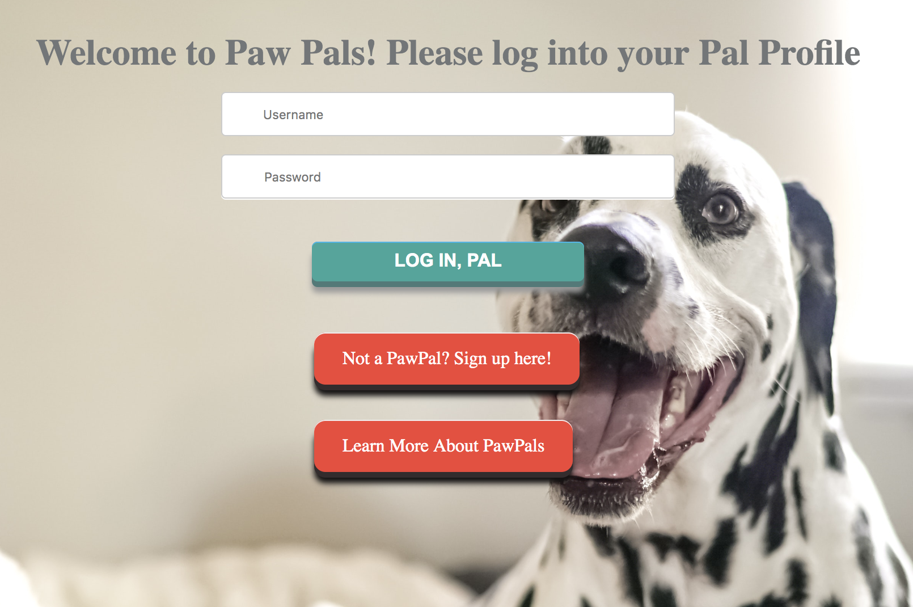
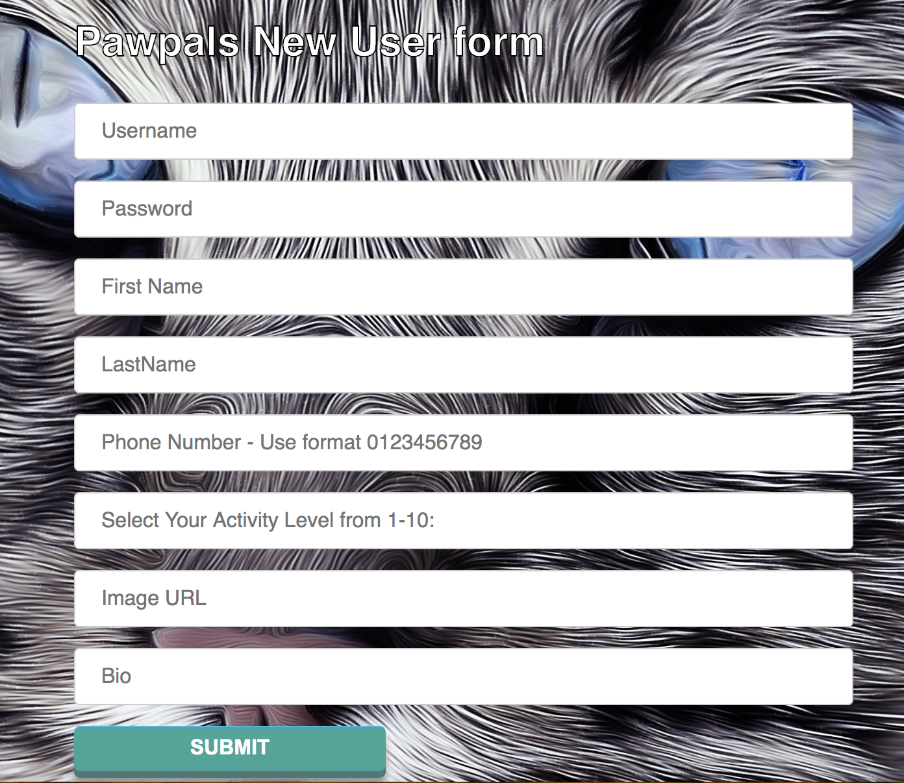
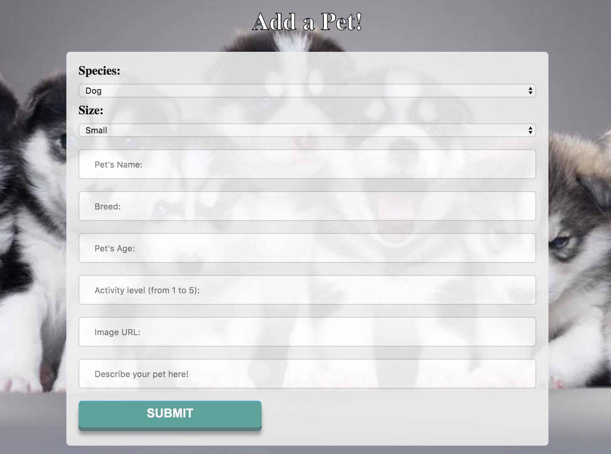
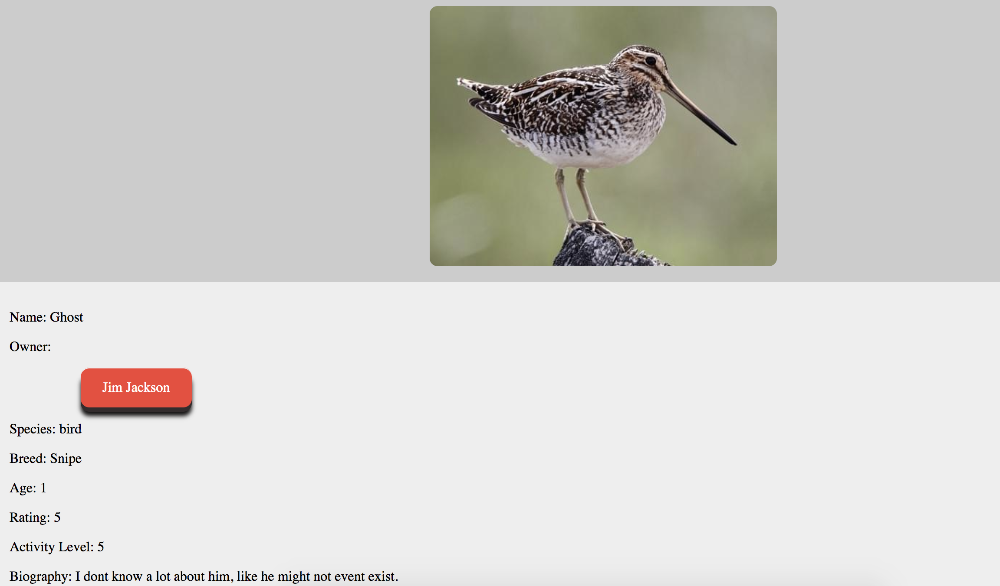
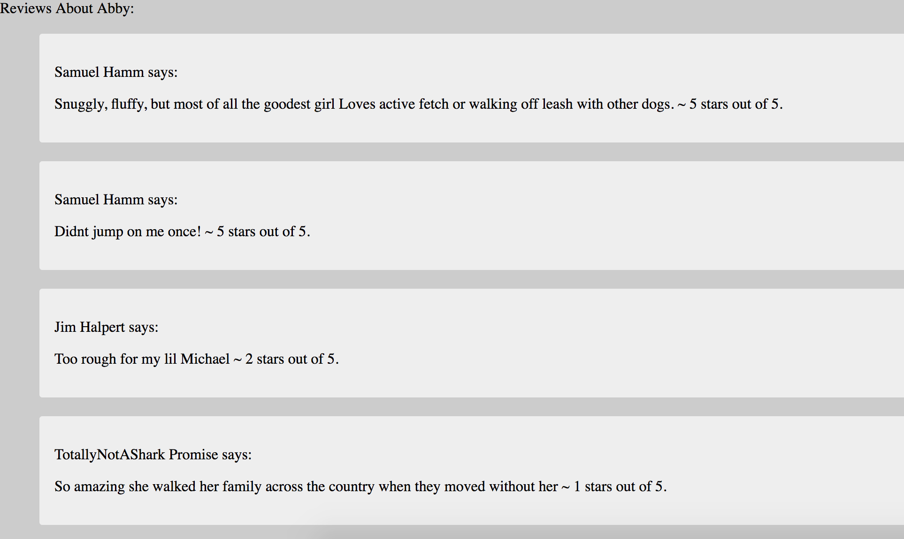
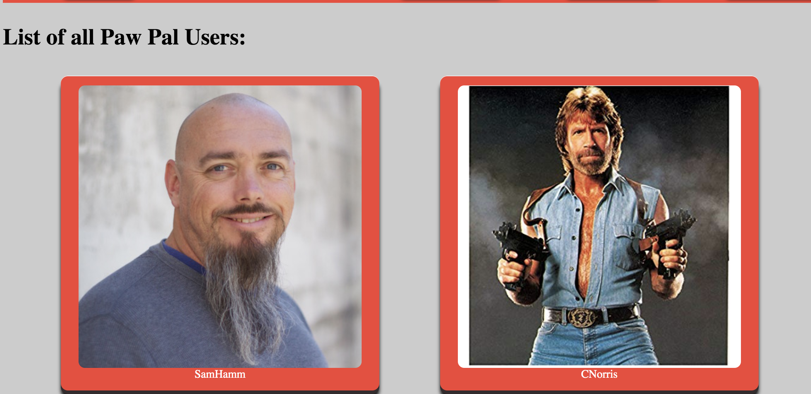

## Pawpals  
**Version**: 1.1.0

## AWS Deployed Site
You can visit the deployed version of this site at [http://pawpals-env.zgv4yj2cpm.us-west-2.elasticbeanstalk.com/](http://pawpals-env.zgv4yj2cpm.us-west-2.elasticbeanstalk.com/).

It was not a taught skill, but we registered a custom domain name, so you can also visit the site at [http://www.pawpals.online](http://www.pawpals.online)!

## Presentation Summary
- PawPals Mission Statement
- DevTeam Intros
- PawPals Demo
- Struggles aka "What didnt kill us made us stronger"
- Future Goals4
- Q & A

## Mission Statement
PawPawls helps animal lovers connect to socialize their new furry family members!

Make a user profile for yourself, add your pets, and start meeting up with others at the dog park or neighborhood walking path!

Once you have found the perfect furry friend for your family member make sure to leave a review to describe their best features so others can join the fun.

Version 1.2.0 will include PlayDate scheduling and mobile friendly views to review on the go.

## Technology Used
- [Java](https://go.java/index.html)
- [AWS](https://aws.amazon.com/)([RDS](https://aws.amazon.com/rds/), [EC2](https://aws.amazon.com/ec2/))
- [Gradle](https://docs.gradle.org/current/userguide/userguide.html)
- [Spring](https://spring.io/)
- [ThymeLeaf](https://www.thymeleaf.org/documentation.html)
- [Google Domains](https://domains.google/#/)

## Authors 
- [Chai Narukulla](https://www.linkedin.com/in/chaitanya-narukulla/)
- [Timothy J Busch](https://www.linkedin.com/in/timothyjbusch/)
- [Kent Ketter](https://www.linkedin.com/in/kent-ketter/)
- [Peter Tynan](https://www.linkedin.com/in/petertynan/)
- [Stephen Chu](https://www.linkedin.com/in/stephenchu530/)

## Overview and User Stories

- As a new user, I should be able to create a new profile with a user name and password selected by me.
- As a registered user, I should be able to update my profile.
- As a registered user, I want to be able to create a pet profile and automatically have it associated my user profile.
- As a registered user, I want to be able to delete a pet profile and have all instances of the pet removed from PawPals.
- As a registered user, I want to be able to review other pets and users that I’ve had contact with.
- As a registered user, I want to look at the profiles of other users and their pets.
- As a registered user, I want a way to show my time availability on my profile.
- As a non registered user I want to see the login page and pet image carousel.

## API

- ```/```
    - default page is the login page
- ```/login```
    - users can login
- ```/signup```
    - user can sign up when visiting for the first time
- ```/users```d
    - display the users based on username
-  ```/myprofile```
    - shows the individual profile of a user
- ```details```
    - see the details of a user when clicking
- ```/aboutpawpals```
    - information about PawPals service and the dev team
- ```/petcreation```
    - form to add a new pet
- ```/registernewpet```
    - address Petcreation form makes a POST request to
- ```/delete/{id}```
    - GET request to delete target pet
- ```/pets```
    - list of all pets
- ```/users/{id}/review```
    - route to send POST request about target user
- ```/pets/{id}/review```
    - route to send POST request about target pet   
- ```/createnewuser```
    - POST route for user creation form
- ```/users/{id}```
    - individual users profile
- ```/updateprofile```
    - form to allow user to update profile, POST mapping
         
## Getting Started

Clone this repository to your local machine.
```git clone https://github.com/team-byte/pawpals.git```

Once downloaded, change directory into the `pawpals` directory.

- IntelliJ
    - open pawpals.java
    - run pawpalsApplication.java 
- Terminal
    - ```psql CREATE DB pawpals;```
    - ```./gradlew test```
    
    - build and run ```./gradlew bootRun```

### Screenshots












## License

This project is licensed under the MIT License - see the [LICENSE.md](LICENSE.md) file for details
